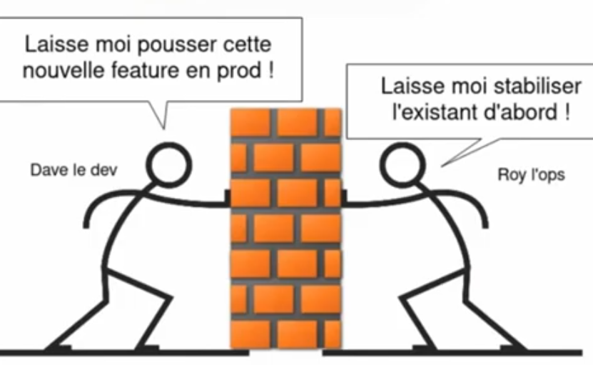

<!-- paginate: false --->
<!-- header: "" -->
<!-- _backgroundColor: #d74946 -->
<!-- _color: white -->

 

# Soutenance de fin d'étude
**Comprendre pour mieux placer efficacement la sécurité dans une approche DevOps** 
 
Julien Briault
Promotion 2021/2022 EISI 22.3 CS | IPSSI

---
<!-- paginate: true --->
<!-- header: _IPSSI/Normation_  -->
## Avant-propos

Les sources (code) sont disponibles sur [Github](https://github.com/julienbriault/presentation).

Cette présentation est sous licence **CC BY-SA FR 2.0** (tout comme le mémoire).

Ainsi chacun est libre de le *diffuser*, de le *modifier*, sans oublier de **citer** l'auteur !

“*L’Homme et sa sécurité doivent constituer la première préoccupation de toute aventure
technologique*” - **Albert Einstein**

---

## ~$ [whoami](https://blog.jbriault.fr/whoami/)

**Julien BRIAULT**

- System Engineer chez **Rudder/Normation**
- Responsable Informatique aux [Restos du Coeur](https://www.restosducoeur.org/) (~ 1 an)
- Auteur principal sur [blog.jbriault.fr](https://blog.jbriault.fr) 
- Développeur C/Golang/Python

**#mao-dj** **#dev**  **#net** **#automation** **#open-source** **#free-software**

---
<!-- header: "" -->

---

# Rudder, qu'ésaquo ?

- Entreprise éditrice de logiciel **Open Source** du même nom
  - Basée à Paris (3ème proche de République)
  - A une dizaine d'années
  - 14 collaborateurs (dont une majorité de devs)
 
- Créatrice du **[DevOps Rex](https://2019.devopsrex.fr/)** (conférence autour du DevOps)

- Le logiciel :
  - Seul acteur *français* et *européen* dans la gestion de configuration et sa mise en conformité des systèmes.
---
<!-- header: _IPSSI/Normation_  -->
# Sommaire

- Introduction
- Conduite et démarche de recherche
- Les origines/ le contexte
- La sécurité dans le DevOps, oui mais comment ?
- Des solutions pour garantir cette sécurité ?
- Conclusion
- Le futur / les projets

---
<!-- _class: lead -->
<!-- _backgroundColor: #2d409e -->
<!-- _color: white -->

# Introduction

---
# Introduction

#### Pourquoi avoir fait ce choix de sujet ?

- Sujet qui me tient à coeur
  - Contributeur à des projets comme [**naxsi**](https://github.com/nbs-system/naxsi) ou encore [**crowdsec**](https://github.com/crowdsecurity/crowdsec). Mais également [Rudder](https://www.rudder.io/)...
- Rudder est un outil qui se veut ***DevSecOps***\*
 

\* Terme marketing pour désigner le fait que l'outil est à destination à la fois des *ops*, des *devs* (dans une certaine mesure) et des *équipes de sécu*.

---

# Introduction

#### Pourquoi avoir fait ce choix de sujet ?

- Beaucoup d'informations autour du DevOps mais peu finalement sur la sécurité dans celui-ci
- Le sujet n'est pas toujours bien compris
  - Détailler pour mieux comprendre pour y insérer les bonnes pratiques de sécurité
- Une réponse souvent logique mais pas évidente à comprendre ni à mettre en place : **DevSecOps**
---

#### Pourquoi avoir fait ce choix de sujet ?

Des programmes de recherche autour du DevOps n'incluant pas la sécurité et mettant l'accent sur les performances.

Exemple : **DORA** (Devop Research and Assessment) de **Google**.

---
<!-- _class: lead -->
<!-- _backgroundColor: #2d409e -->
<!-- _color: white -->
# Conduite et démarche de recherche
---

# Conduite et démarche de recherche

- L'acquisition des connaissances se traduit par l'***intuition*** et l'***expérience personnelle*** (selon [FORTIN](http://cours-ifcs-brunopoupin.wifeo.com/documents/La-dmarche-de-Recherche.pdf)).

- J'entends par :
  - L'**intuition** : connaissance immédiate du sujet abordé
  - L'**expérience personnelle** : l'essai et l'errreur 

- Cette démarche ne resulte en rien d'un *raisonnement logique* (au sens scientifique du terme).

---
<!-- _class: lead -->
<!-- _backgroundColor: #d25a2e -->
<!-- _color: white -->

# Les origines/le contexte
---
# Les origines

\**Image tirée du talk de *Denis GERMAIN* nommé **[SRE](https://www.youtube.com/watch?v=C8bcFLmZzAY)**.*

---

Un contexte particulier...

- Besoin clients qui changent continuellement
- Time-to-market réduit (concurrents, réglementations)

> Emergence des pratiques agiles et de la culture DevOps

---

* Limites de l'approche de sécurisation traditionnelle
  * Séparation des rôles
  * Droit de veto de l'équipe sécurité
  * Sécurisation sur des besoins figés, spécifications formalisées
  * Stopper pour auditer

  
- Analyse des concepts fondamentaux du DevOps
  - **Kaizen** (amélioration continue)
  - **Scrum** (méthode : comment collaborer ?)
  - **Lean Startup** (constuire, mesurer, apprendre)
  - **Agilité**
---

<!-- _class: lead -->
<!-- _backgroundColor: #2d409e -->
<!-- _color: white -->
# Rentrer dans le vif du sujet
--- 
# La sécurité, oui mais comment ?

- Reprendre les différentes étapes du DevOps (*plan*, *build*, *release*, *deploy*, *operate*, *monitor*).
  - Comprendre
  - Déterminer les actions pour la sécurité déjà apportés
  - Améliorer
---

- Apporter des solutions méthodologiques et techniques à chaque pan du DevOps.
- Mais, ce n'est pas que de la technique...
  - D'après le **DEDSORD**, il est souvent oublié, le point de vu *business* (des histoires de ROI par exemple).
  - Le **BIA** (Business Impact Analysis) plus qu'important mais trop souvent oublié

---
<!-- _class: lead -->
<!-- _backgroundColor: #137a66 -->
<!-- _color: white -->

# Finalité
---
# Des solutions

Le choix des solutions c'est principalement basé sur une analyse de receuils de bonnes pratiques et d'expériences personnelles/professionnelles.

---
#### La collaboration
* L'équipe sécurité travaille avec les développeurs (l'équipe "DevOps")
  * Dès le début des projets ("*shift security to the left*")
  * Rédiger des user stories orientées sécurité (> scénarios d'abus)
  * Partage d'expérience (communication ++)
* Aller plus loin :
  *  Nomination de **security champions**
      \+ Scalabilité
      \+  Diffusion naturelle des bonnes pratiques

---

#### La formation/sensibilisation

- Formation au développement sécurisé
  - OWASP Top 10
  - CWE Top 25
  - Certifications : *GWEB*, *CSSLP*, *CASE*
- Sensibilisation
  - Par l'équipe sécurité
    - Démos de piratage (DVWA, Metasploitable)
  - E-Learning
  - OWASP Top 10 (bis)

---

#### L'automatisation!

* Le pipeline de CI/CD doit inclure les tests de sécurité 
  * **Antifragilité** : amélioration par le stress!

* Freins pour l'adoption
  * Faux positifs
  * Findins non activables 
  * Lenter des outils SAST/DAST
  * CVE sans solution, ça peut stopper complètement un déploiement! 

---

#### L'outillage 

* **Lint**
  * Vérification des bonnes pratiques de développement
  * Contrôles basiques de sécurité
    * Appels systèmes (injection de commandes)
    * Expressions régulières (ReDoS, safe-regex)
* **SCA - Software Composition Analysis**
  * Identification des dependances open-source vulnérables
  * Possibilité de configurer des politiques (CVSS)

---

* **SAST** Static Application Security Testing / White box
  * Recherche de vulnérabilités dans le code source
    * Log4j/log4shell avec [Sonarqube](https://www.sonarqube.org/) 

* **DAST** Dynamic Application Security Testing / Black box
  * Analyse de vulnérabilités sur l'application qui tourne
  * Appelé aussi "stress test"

---

### Recueil des bonnes pratiques

**DevSecOps** une évidence, expliqué, détaillé avec un ensemble de bonnes pratiques, c'est mieux! 

Naissance du **DoD Enterprise DevSecOps Reference Design** ([DEDSORD](https://dodcio.defense.gov/Portals/0/Documents/DoD%20Enterprise%20DevSecOps%20Reference%20Design%20v1.0_Public%20Release.pdf))
* Donne une vision claire des bonnes pratiques DevSecOps à avoir
* Essaie d'apporter toutes les réponses sur l'implémentation de ces bonnes pratiques
  * Fournissant des *méthodes* et non de la technique.

---
<!-- _class: lead -->
<!-- _backgroundColor: #531f61 -->
<!-- _color: white -->

# Le futur / les projets
---
# Le futur / les projets
#### Le retour aux sources

- Premier CDI *signé*
- Poste : **Network Engineer SRE** 

**#network** **#sre** **#core-infra** **#automation**

---
# Le futur / les projets

Créer une startup autour du projet [**Ichigo**](https://github.com/ichigoproject).

- Projet à orientation **NetDevOps**
  - Automatisation
  - Déploiement
  - Audit
  - Sauvegarde

---
<!-- header: "" -->

 
# Merci pour votre écoute !
Place aux questions !

---
