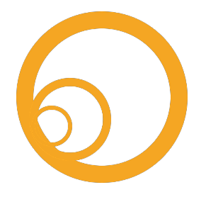

<!-- _class: lead -->
<!-- paginate: false --->
<!-- header: "" -->

# Soutenance de fin d'étude
**Comprendre pour mieux placer efficacement la sécurité dans une approche DevOps**
 
Julien Briault - EISI 22.3 CS - IPSSI

---
<!-- paginate: true --->
<!-- header: _IPSSI/Normation_  -->
## Avant-propos

Les sources (code) sont disponibles sur [Github](https://github.com/julienbriault/presentation).

Cette présentation est sous licence **CC BY-SA FR 2.0** (tout comme le mémoire).

Ainsi chacun est libre de le *diffuser*, de le *modifier*, sans oublier de **citer** l'auteur !

---

## ~$ [whoami](https://blog.jbriault.fr/whoami/)

**Julien BRIAULT**

- System/DevOps Engineer chez **Rudder/Normation**
- Responsable Informatique aux [Restos du Coeur](https://www.restosducoeur.org/)
- Auteur principal sur [blog.jbriault.fr](https://blog.jbriault.fr)
- Développeur C/Golang/Python

**#mao-dj** **#dev** **#net** **#automation** **#open-source** **#free-software**

---
<!-- header: "" -->

---
<!-- header: _IPSSI/Normation_  -->
# Sommaire

- Introduction
  - Les motivations : pourquoi ce choix de sujet ?
- Conduite et démarche de recherche
- La sécurité dans le DevOps, oui mais comment ?
- Des solutions pour garantir cette sécurité ?
- Dans la vie, ça marche comment ?
- Conclusion
- Le futur

---

# Introduction

#### Pourquoi avoir fait ce choix de sujet ?

- Sujet qui me tient à coeur
  - Contributeur à des projets comme [**naxsi**](https://github.com/nbs-system/naxsi) ou encore [**crowdsec**](https://github.com/crowdsecurity/crowdsec).

---

# Le futur
#### Le retour aux sources

- Premier CDI *signé*
- Poste : **Network Engineer SRE** 

**#network** **#sre** **#core-infra** **#automation**

---

# Le futur

Créer une startup autour du projet [**Ichigo**](https://github.com/ichigoproject).

- Projet à orientation **NetDevOps**
  - Automatisation
  - Déploiement
  - Audit
  - Sauvegarde

---
<!-- header: "" -->

 
# Merci pour votre écoute !
Place aux questions !

---
